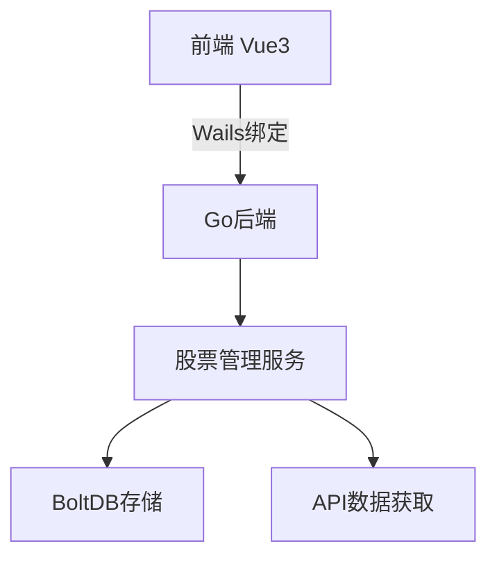

# 股票监控系统

基于Wails + Go + Vue3的股票数据监控系统

## 功能特性

- ✅ 股票代码管理 (添加/删除)
- ✅ 实时数据获取 (并发请求)
- ✅ 响应式界面 (支持精简模式)
- ✅ 数据持久化 (BoltDB存储)
- ✅ 错误处理与日志

## 技术架构



## 快速开始

1. **安装依赖**
```bash
go mod tidy
cd frontend && npm install
```

2. **开发运行**
```bash
wails dev
```

3. **构建发布**
```bash
wails build
```

## 配置说明

1. **API设置**  
编辑 `internal/stock/manager.go` 中的 `fetchStockFromAPI` 函数  
替换为实际的股票API调用

2. **存储位置**  
数据默认存储在: `./stockdata.db`

## 界面预览


## 后续计划

- 添加K线图表
- 实现预警功能
- 支持多数据源
- 增加用户认证
```

## 项目结构

```
makedemo/
├── internal/
│   ├── storage/      # 数据存储模块
│   ├── stock/        # 股票业务逻辑
│   └── bindings/     # 前端绑定
├── frontend/         # Vue3前端
│   ├── src/
│   │   ├── stores/   # Pinia状态管理
│   │   └── components/
└── README.md
```